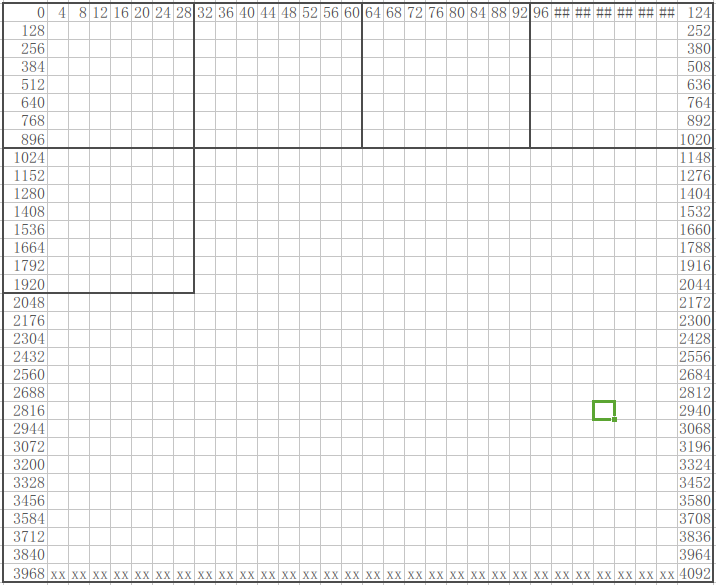
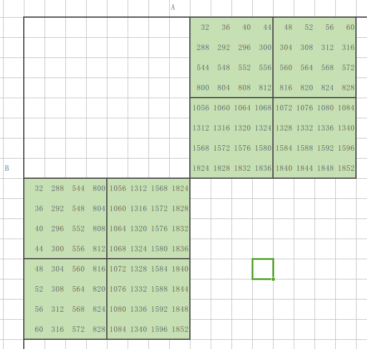

# lab4_cachelab

## Part A: 写一个cache模拟器

cache的结构如图：  

  

cache就是把 主存中2^64(实际可用的只有2^48)个地址 map到一个E×2^s*2^b个地址的cache中。

当需要索引地址A时，先判断其是否在cache中：
1. 提取A的组索引位 和 标记位
2. 通过组索引位 找到A所对应的组(set)
3. 通过标记位，在该组中 看 能否找到对应标记位的 block，如果能，那么A在cache中；否则，A需要从主存中 加载到cache中。  
这个找的过程是 通过遍历该组中的所有block来 实现的(实际的硬件应该已经设计了相应的机制，所以实际应该O(1)就能判断A是否在cache中)。

代码中定义数据结构block:  
tag参数说明该block的tag值  
valid参数 说明该block是否有效  
timestamp参数 用来实现LRU(least-recent used)  

cache模拟器中，E、s、b都不确定。那么在 运行时，动态地分配2^s*2^b个block的数组blocks
通过blocks的索引确定 每个block所在的set 和 line。

相对于PartB来说，PartA比较简单，只需要注意以下几点即可：
1. 输入的地址是16进制的，而不是10进制的...  
2. eviction使用的是LRU(least-recent used)策略，而不是 最少使用的被换出。

## partB：矩阵转置优化

要求：实现矩阵转置:对于输入的矩阵A(NxM)，输出其转置B(MxN)，并且使得cache的miss次数尽可能地小。最多只能使用12个局部变量。其中cache的参数为(s=5, E=1, b=5)

32x32的矩阵：miss次数<300
64x64的矩阵：miss次数<1300
61x67的矩阵：miss次数<2000

因为cache的参数为(s=5, E=1, b=5)
所以对于一个地址，它的高54位(64-s-b)表示tag，set和block偏移只与低10位有关。

block的大小为2^5=32字节=8个int，说明每个line中能存8个连续的整数。

先通过调试，观察程序中A、B的内存分布，可以发现&B-&A=65536。
即A、B的首地址总会相差65536(00000000 00000001 00000000 00000000)，那么其实A，B中的对应元素在cache中的分布是相同的（因为65536的前10位都是0，和0一样）。

### 32x32的矩阵

不妨设A的首地址为0，画出A对应的32x32元素的地址分布：
  

然后计算每个元素对应存放的set：
  

这里记8x8大小的方块为一个chunk。
对于32x32的矩阵，可以分为16个chunk。

不难发现，对于不处在对角线上的chunk，关于对角线对称的2个chunk中的元素所 存放的set是完全错开的。

那么对于不处在对角线上的一对chunk，我们可以通过16(8+8)个miss来进行转置。

一共有3*4对 不在对角线上的chunk，那么一共需要12*16=192个miss来转置。

设处在对角线的chunk，需要cx个miss来进行转置。由于要求最多300个miss，那么有
192+4*cx<=300, 解出
cx<=27才行。

#### 处在对角线上的chunk

通过以下步骤来进行转置：  
step1: A的右上到 B的左下，A的左上到B的右下。(A:4miss  B:4miss)  
step2：B的右下到B的左上 (B:4miss)  
step3：A的左下到B的右上  在局部变量里面记录A的右下的 前2行的值  (A:4miss)  
step4: A的右下的 后2行的值 存到B的右下的前2行中(B:2miss)  
step5: A的右下的 4x4的内部操作 并且使用上前面的局部变量值(B:2miss)  

  

粗略估计 一共192+4×20=272个miss。最后结果为275个miss，和估计结果差不多。

## 64x64的矩阵

和32x32类似，第一步，我们先观察64x64矩阵的元素的内存分布，画出 每个元素对应的set：
 

不难发现，尽管 关于对角线 对称的8x8的chunk使用的set还是互斥的，但 chunk内部的一半的元素却使用了 相同的set。

这是64x64的其中一个难点。

### 处理非对角线上的chunk对

同样地，64x64也使用了大小为8x8的chunk。

如图8x8的chunk A，转置后会放到chunk B中：  
 

不难发现如下规律：  
A左上-->B左上  
A右上-->B左下  
A左下-->B右上  
A右下-->B右下  

我们可以通过如下步骤进行转置：
1. A的左上到B的左上,同时变量记录A的右上的前2行的值(8miss)
2. A的左下到B的右上(4miss)
3. A的右下到B的右下(4miss)
4. A的右上下面2行 以及局部变量 到B的左下(2miss)
一共18miss

 

### 处理对角线上的chunk

处理64x64的对角线上的chunk是lab4最难的地方。

先计算我们还剩多少个miss可用。  
18×(7×8)+8×cx<=1300,得出  
cx=36misses  
每个对角线上的chunk的处理，最多只能用36个miss

先把8x8的chunk拆成2x2的chunk。

处理对角线的chunk的步骤：
1. 按照图中的顺序复制A的第1行到B(10miss)  
2. 按照图中的顺序复制A的第2行到B(8miss)  
3. 按照图中的顺序复制A的第3行到B(8miss)  
4. 按照图中的顺序复制A的第4行到B(8miss)  

步骤2比步骤1少2个miss的原因是，步骤2的第1个复制时，使用了步骤1最后的那个热区(B的第一行)

步骤如图：（每个四方形是2x2的chunk）  
 

对角线的8x8的chunk需要34个miss。所以，64x64一共需要 20×(7×8)+8×34=1280个miss。最终结果为1291个miss，符合预期。

## 61x67(实际是67x61)的矩阵

因为这个矩阵是不规则的，所以没办法定量的分析它。只能定性地感觉，要合理选取chunk的大小就能达到要求。

通过不断实验，发现  

主体部分使用16x8的chunk，剩下的边缘部分用3x8的chunk时，效果是最好的，只有1953个miss。

最终，所有的结果：
./driver.py

 

