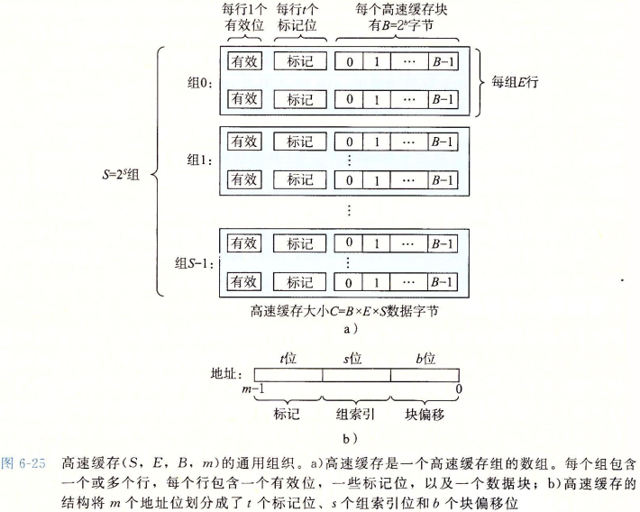
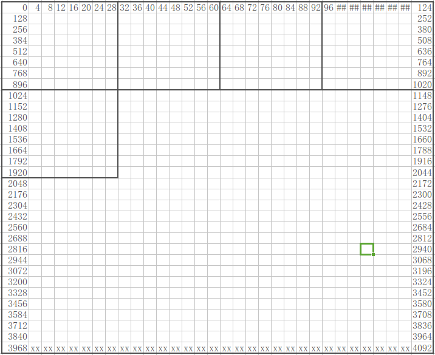
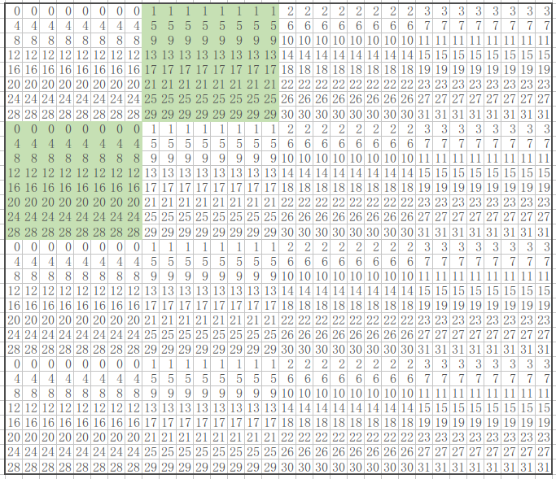

# lab4_cachelab

## Part A: 写一个cache模拟器

cache的结构如图：  

  

cache就是把 主存中2^64(实际可用的只有2^48)个地址 map到一个E×2^s*2^b个地址的cache中。

当需要索引地址A时，先判断其是否在cache中：
1. 提取A的组索引位 和 标记位
2. 通过组索引位 找到A所对应的组(set)
3. 通过标记位，在该组中 看 能否找到对应标记位的 block，如果能，那么A在cache中；否则，A需要从主存中 加载到cache中。  
这个找的过程是 通过遍历该组中的所有block来 实现的(实际的硬件应该已经设计了相应的机制，所以实际应该O(1)就能判断A是否在cache中)。

代码中定义数据结构block:  
tag参数说明该block的tag值  
valid参数 说明该block是否有效  
timestamp参数 用来实现LRU(least-recent used)  

cache模拟器中，E、s、b都不确定。那么在 运行时，动态地分配2^s*2^b个block的数组blocks
通过blocks的索引确定 每个block所在的set 和 line。

相对于PartB来说，PartA比较简单，只需要注意以下几点即可：
1. 输入的地址是16进制的，而不是10进制的...  
2. eviction使用的是LRU(least-recent used)策略，而不是 最少使用的被换出。

## partB：矩阵转置优化

要求：实现矩阵转置:对于输入的矩阵A(NxM)，输出其转置B(MxN)，并且使得cache的miss次数尽可能地小。最多只能使用12个局部变量。其中cache的参数为(s=5, E=1, b=5)

32x32的矩阵：miss次数<300
64x64的矩阵：miss次数<1300
61x67的矩阵：miss次数<2000

因为cache的参数为(s=5, E=1, b=5)
所以对于一个地址，它的高54位(64-s-b)表示tag，set和block偏移只与低10位有关。

block的大小为2^5=32字节=8个int，说明每个line中能存8个连续的整数。

先通过调试，观察程序中A、B的内存分布，可以发现&B-&A=65536。
即A、B的首地址总会相差65536(00000000 00000001 00000000 00000000)，那么其实A，B中的对应元素在cache中的分布是相同的（因为65536的前10位都是0，和0一样）。

### 32x32的矩阵

不妨设A的首地址为0，画出A对应的32x32元素的地址分布：
  

然后计算每个元素对应存放的set：
  

这里记8x8大小的方块为一个chunk。
对于32x32的矩阵，可以分为16个chunk。

不难发现，对于不处在对角线上的chunk，关于对角线对称的2个chunk中的元素所 存放的set是完全错开的。

那么对于不处在对角线上的一对chunk，我们可以通过16(8+8)个miss来进行转置。

一共有3*4对 不在对角线上的chunk，那么一共需要12*16=192个miss来转置。

设处在对角线的chunk，需要cx个miss来进行转置。由于要求最多300个miss，那么有
192+4*cx<=300, 解出
cx<=27才行。

#### 处在对角线上的chunk

