# lab6 Malloc lab

这个实验是实现一个Malloc模拟器，目标是 获得 高的 利用率 和 吞吐量。

一共分成3个阶段：
1. 隐式空闲链表(最简单，但效率最低)
2. 显式空闲链表(难度较高，效率一般)
3. 分割空闲链表(难度很高，效率较高)

## 隐式空闲链表

堆块的格式：(书上P595)  
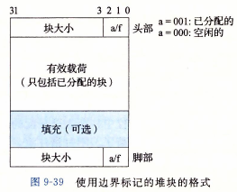  

链表的结构：(书上P598)  
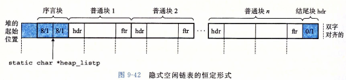  

除了普通块，还需要引入序言块和结尾块，分别表示链表的开头和结尾。

隐式的意义：没有一条显式的链表存放所有空闲的块，只有一条完整的存放 所有块的链表。如果需要找到一个符合要求的空闲的块，需要从头开始，一个个判断每个块是否分配。

隐式空闲链表实现比较简单，书上几乎涵盖了所有代码，自己只需要写find_fit函数 和 place函数 即可。注意：一些宏的定义 和 使用，可以 减少繁琐的代码，以便debug。

最后跑分的结果为(mm-implict.c)：  
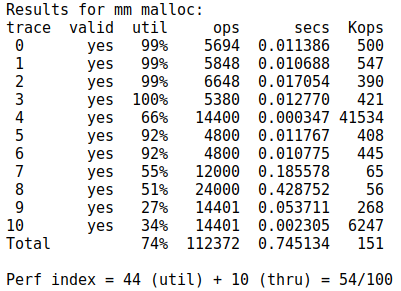 

可以看到，它的效率是比较低的。特别是吞吐量只有10分，这是因为每次分配都需要遍历 包括已经分配的块的原因。

## 显式空闲链表

显式空闲链表：就是有一条明确的表示所有空闲块的链表。

具体的数据结构 和 算法 在课程的课件上面有(20-malloc-advanced.pdf)。但它的表示顺序 和 书上 略有不同（next和prev的位置调换了，我以课件上的为准）

已分配的块的结构和隐式空闲链表的块相同，而空闲的块中多了Next和Prev指针(实际上是相对于头结点heap_listp的偏移，下面都用偏移代替)，分别指向上一个空闲的块，以及下一个空闲的块。为了和Next（下一个空闲块的偏移）、Prev区别（上一个块的偏移），前后邻接的块称为Predecessor（邻接的上一块）和Successor（邻接的下一块）。

堆块的数据结构：  
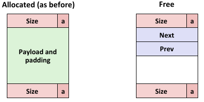 

因为Next和Prev的引入，所以一个空闲块的大小不得小于16字节。

链表的数据结构：  
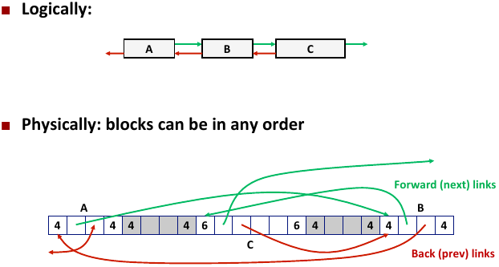  

算法的关键在于释放块时的合并操作，根据释放的空块的前后块(predecessor和successor)是否分配，一共分成4种情况：

### case1: 释放的空块的前后块都以分配：（图中的标号表示操作顺序）

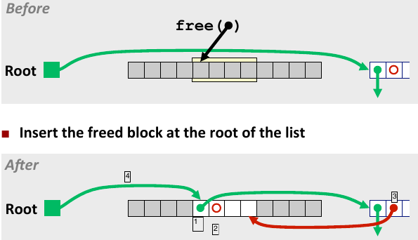 

### case2: 释放的空块的后面的块是未分配的：  
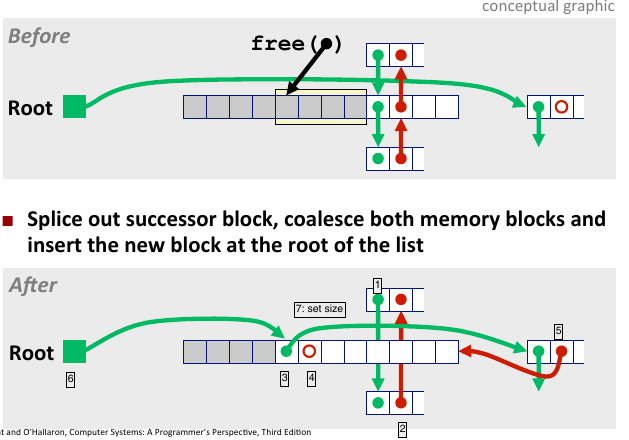 

### case3: 释放的空块的前面的块是未分配的：  
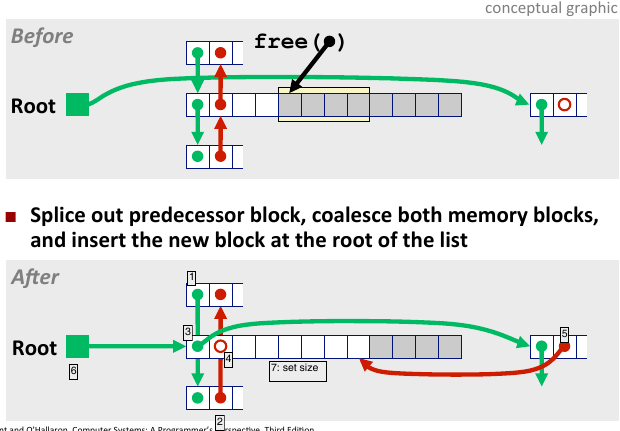 

### case4: 释放的空块的前后的块都是未分配的： 
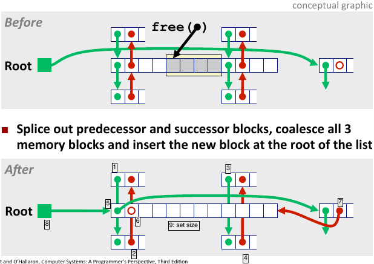 

最后跑分的结果为(mm-explicit.c)：  
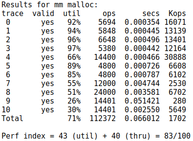 

83分，还不错，实际上做到这个地方，可以不继续做segregate的分割空闲链表的那种算法了，因为比较复杂，而且数据结构的设计要比较有针对性。我花了1天做出来的第一个版本的效果还没有这个显式的效果好...第2天才换了一种数据结构。

## 分割空闲链表

显式空闲链表把所有的空闲的块都放在同一个链表中，但需要某个特定大小的块时，还是得从这个空块的开头开始遍历，效率仍比较低。分割空闲链表的思想就是 不同的空闲的链表 维护 不同大小的空闲块，当需要某个类型的空闲块时，就去特定的链表中查找。

而且空间复杂度也不会太高，只是 序言块 和 结尾块多了几个 块来 维护不同链表的头节点。

设计一个好的数据结构是一个难点。

版本1(效率甚至比显式的低)：根据对trace file的分析(traceFileAnalysis.cpp)，我把alloc最多的11种块大小分离出来，别的大小的块做成一个通用的链表。链表的数据结构：
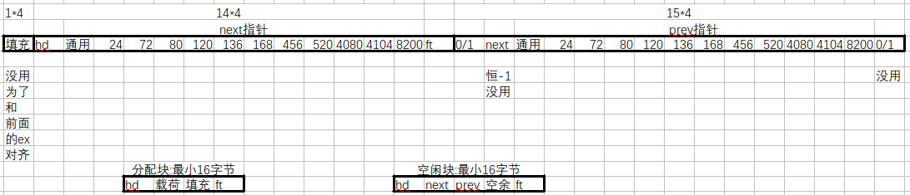 

最后跑分的结果为(mm-segrete_v1.c)：  
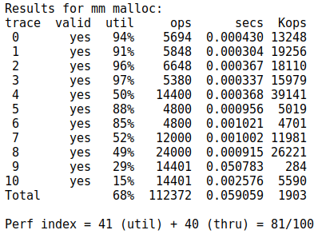 

只有81分，不再赘述。

后来，换了一个数据结构，并针对realloc重新设计mm_realloc的算法：
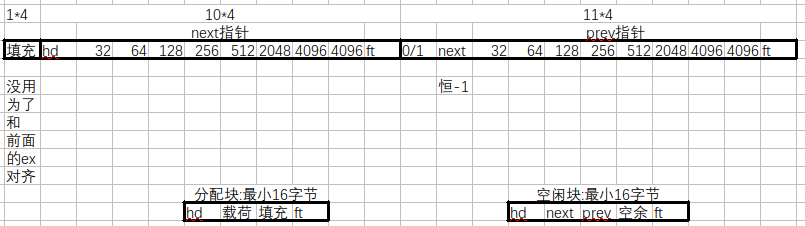

最后跑分的结果为92分(mm-finalversion.c)：  
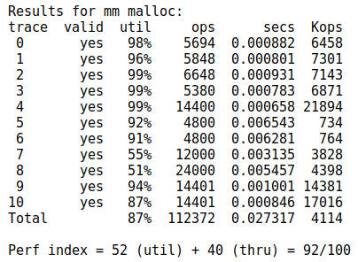 

